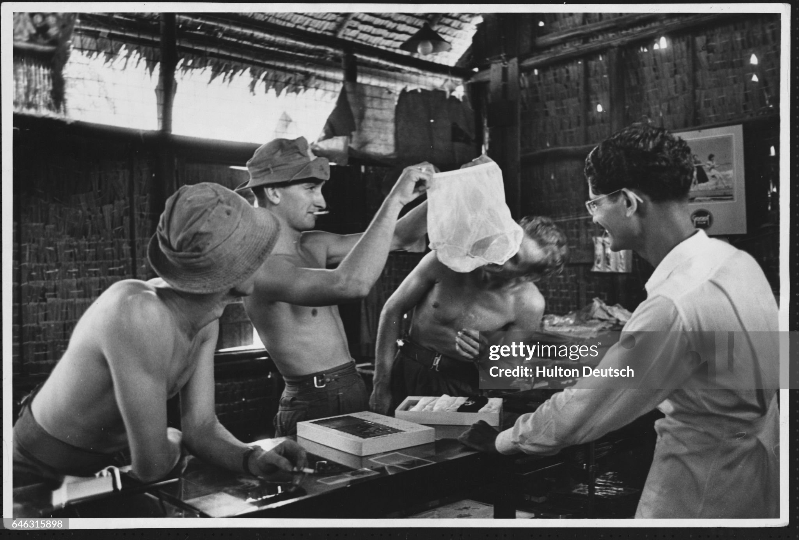
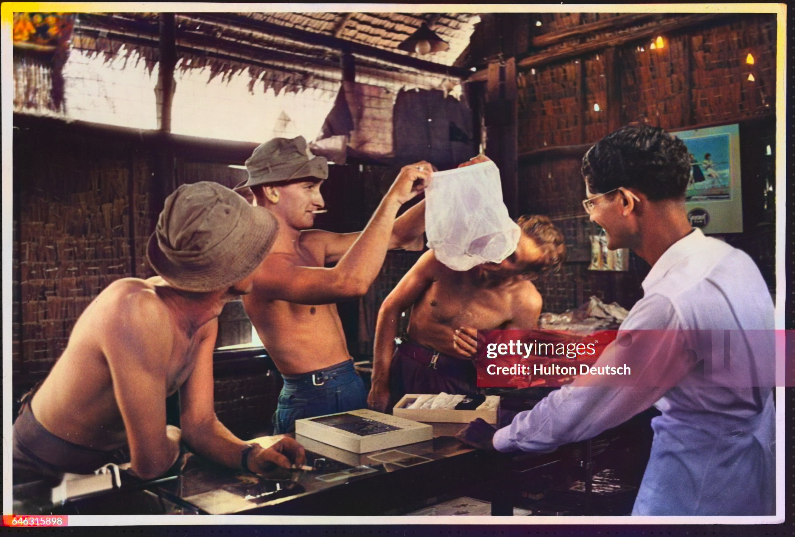

# re-DDColor: Enhanced Image Colorization

A revised and improved version of [DDColor](https://github.com/piddnad/DDColor), offering additional features and optimizations for image colorization.

**This project is developed as part of my Bachelor of Computer Engineering with Honours Final Year Project (2025).**

[](LICENSE)

## Overview

DDColor is a state-of-the-art automatic image colorization framework proposed in the paper "DDColor: Towards Photo-Realistic Image Colorization via Dual Decoders" (ICCV 2023). This revised version maintains the core functionality while adding new features, optimizing performance, and improving user interfaces.

## Example Results

Below is a comparison of the input black-and-white images and the colorized outputs generated by re-DDColor:

| **Before** (Black & White) | **After** (Colorized) |
|-----------------------------|-----------------------|
|  |  |

You can try colorizing your own images using the methods described in the [Usage](#usage) section.

## New Features in This Version

### Performance Improvements
- Added support for Apple Metal Performance Shaders (MPS) for better performance on Mac devices
- Optimized memory usage for improved processing on devices with limited resources
- Enhanced inference pipeline for faster colorization

### Interface Enhancements
- **Gradio Web UI**: Added interactive web interface for easy colorization with before/after slider comparison
- **Flask API**: Implemented a REST API for integration with other applications
- **Video Processing**: Extended support for colorizing videos frame by frame
- **Improved CLI**: Enhanced command-line interface with more options and better feedback

### Technical Improvements
- Better cross-platform compatibility (Windows, macOS, Linux)
- Streamlined installation process with clearer dependencies
- Additional model configuration options
- Enhanced error handling and recovery
- Comprehensive documentation

## Installation

```bash
# Clone the repository
git clone https://github.com/yourusername/re-DDColor.git
cd re-DDColor

# Install dependencies
pip install -r requirements.txt

# Download pre-trained models (automatically done on first run)
python pretraindownload.py
```

## Docker Implementation

For the easiest and most consistent experience across different platforms, you can use Docker:

```bash
# Build the Docker image
docker build -t ddcolor-app .

# Run the container
docker run -p 8501:8501 ddcolor-app

# Access the web application
# Open http://localhost:8501 in your browser
```

### Advantages of using Docker:
- No need to install dependencies manually
- Works consistently across Windows, macOS, and Linux
- Model is downloaded automatically during the build process
- All required libraries are pre-configured

### Requirements:
- Docker installed on your system ([Get Docker](https://docs.docker.com/get-docker/))
- At least 2GB of free disk space

## Usage

### Web Interface (Gradio)

The easiest way to use re-DDColor is through the Gradio web interface:

```bash
python gradio_app.py
```

This will start a local web server with an interactive UI where you can:
- Upload black and white images
- View colorization results with a before/after slider
- Download the colorized images

### REST API (Flask)

For integration with other applications:

```bash
python flaskapi.py
```

The API will be available at `http://localhost:5000/` with the following endpoints:
- `POST /colorize`: Upload an image for colorization
- `GET /models`: List available models

### Command Line

For batch processing or scripting:

```bash
# Colorize a single image
python predict.py --input path/to/image.jpg --output path/to/output.jpg

# Colorize all images in a directory
python predict.py --input path/to/input_dir --output path/to/output_dir

# Specify a different model
python predict.py --input image.jpg --output output.jpg --model ddcolor_artistic.pth
```

### Video Colorization

To colorize videos:

```bash
python video_converter.py --input path/to/video.mp4 --output path/to/colorized_video.mp4
```

## Available Models

re-DDColor includes several pre-trained models as described in [MODEL_ZOO.md](MODEL_ZOO.md):

| Model | Description | Best For |
|-------|-------------|----------|
| `ddcolor_modelscope.pth` (default) | DDColor-L with cleaned data | General use, best quality |
| `ddcolor_paper.pth` | Original paper model | Paper reproduction |
| `ddcolor_artistic.pth` | Trained with artistic images | Creative colorization, fewer artifacts |
| `ddcolor_paper_tiny.pth` | Lightweight model | Resource-constrained devices |

## Technical Details

### Architecture

re-DDColor uses a dual-decoder architecture:

1. **Encoder**: ConvNeXt-based (tiny or large variants)
2. **Decoder**: Two options:
   - `MultiScaleColorDecoder`: Transformer-based decoder with multi-scale features
   - `SingleColorDecoder`: Simpler decoder for faster inference
3. **Color Processing**: Lab color space for accurate colorization

### System Requirements

- Python 3.7+
- PyTorch 1.7+
- CUDA-compatible GPU (recommended) or Apple Silicon
- 4GB+ VRAM for large models, 2GB+ for tiny models

## Training Your Own Model

To train a custom model:

```bash
# Edit the configuration
# Modify options/train/train_ddcolor.yml with your dataset paths and parameters

# Start training
python basicsr/train.py -opt options/train/train_ddcolor.yml
```

See the training configuration file for details on available options including loss functions, optimizers, and data augmentation.

## Citation

If you use this code in your research, please cite the original DDColor paper:

```bibtex
@inproceedings{kang2023ddcolor,
  title={DDColor: Towards Photo-Realistic Image Colorization via Dual Decoders},
  author={Kang, Xiaoyang and Yang, Tao and Ouyang, Wenqi and Ren, Peiran and Li, Lingzhi and Xie, Xuansong},
  booktitle={Proceedings of the IEEE/CVF International Conference on Computer Vision},
  year={2023}
}
```

## Acknowledgements

This work is a revised version of the original [DDColor](https://github.com/piddnad/DDColor) project by Xiaoyang Kang et al. I thank the original authors for their outstanding contribution to the field of image colorization.

## License

This project is licensed under the terms of the LICENSE file included in the repository.